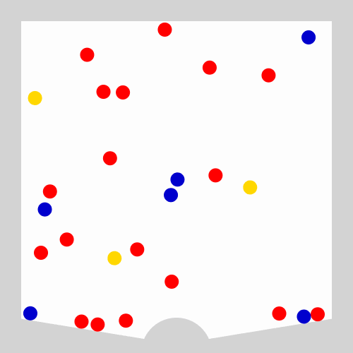

# bingo-blower.js
A virtual bingo-blower for ambiguity and risk experiments.



\* This is a recording: the real-time version in the [demo](https://geoffreycastillo.com/bingo-blower-js-demo/) looks better.

## Demo
https://geoffreycastillo.com/bingo-blower-js-demo/

## Installation
`bingo-blower.js` uses [`matter.js`](https://github.com/liabru/matter-js).
Include both, for example from [jsDelivr](https://www.jsdelivr.com/):
```html
<script src="https://cdn.jsdelivr.net/npm/matter-js@0.20.0/build/matter.min.js"></script>
<script src="https://cdn.jsdelivr.net/gh/geoffreycastillo/bingo-blower-js@v1.1.0/bingo-blower.min.js"></script>
```
Always pin the version (`@v1.1.0` above), so that a new release cannot change your experiment while it is running.
You can also download `bingo-blower.js` from the [releases](https://github.com/geoffreycastillo/bingo-blower-js/releases) and host it yourself.

## Quick start
```html
<canvas id="world"></canvas>
<button type="button" id="draw">Draw a ball</button>
The ball drawn is: <span id="result"></span>

<script src="https://cdn.jsdelivr.net/npm/matter-js@0.20.0/build/matter.min.js"></script>
<script src="https://cdn.jsdelivr.net/gh/geoffreycastillo/bingo-blower-js@v1.1.0/bingo-blower.min.js"></script>
<script>
    const blower = new BingoBlower();
    blower.addBalls([1, 2, 3]);
    document.getElementById('draw').addEventListener('click', async () => {
        const draw = await blower.drawBall();
        document.getElementById('result').textContent = draw.label;
    });
</script>
```

See the [wiki](https://github.com/geoffreycastillo/bingo-blower-js/wiki) for advice on using `bingo-blower.js` in an experiment, including with oTree.

## Examples

Create a bingo-blower with bigger balls: `new BingoBlower({ballSize: 30})` (you will also need to increase `windForce` or decrease `density`, because bigger balls are heavier!)

Blur the bingo-blower for the first 3 seconds, so that the balls are harder to count: `new BingoBlower({revealSeconds: 3})`

Add a lot of balls: `blower.addBalls([10, 15, 20, 25])`

Same number of balls but base64-encoded: `blower.addBalls('WzEwLDE1LDIwLDI1XQ==')`

Add balls in your own colours: `blower.addBalls([1, 2, 3], ['MediumVioletRed', 'HotPink', 'Pink'])`

## API

### `new BingoBlower(options)`

Draws a bingo-blower on a canvas and starts the simulation.
All options are optional.

| Option | Default | Description |
| --- | --- | --- |
| `el` | `'world'` | Id of the canvas where the bingo-blower is drawn |
| `width` | `500` | Width and height of the bingo-blower, which is a square |
| `wallWidth` | `60` | Width of the walls |
| `ballSize` | `10` | Radius of the balls |
| `density` | `0.004` | Density of the balls |
| `friction` | `0.02` | Friction of the balls |
| `frictionAir` | `0.001` | Air resistance of the balls |
| `frictionStatic` | `0.001` | How much force it takes to move a stationary ball |
| `restitution` | `0.7` | Bounciness of the balls |
| `windForce` | `9e-4` | How strong the air blows at the bottom of the blower |
| `targetColour` | `'LightGray'` | Colour of the target |
| `targetWidth` | `50` | Width of the target |
| `targetThickness` | `10` | Thickness of the target |
| `drawnBallHighlight` | `'Black'` | Colour of the circle around the ball drawn |
| `drawnBallThickness` | `10` | Thickness of the circle around the ball drawn |
| `timeSeconds` | `3` | How long the balls keep tumbling after the target appears |
| `revealSeconds` | `0` | How long the blower takes to go from blurry to sharp (0 for no blur) |

See the [matter.js documentation](https://brm.io/matter-js/docs/classes/Body.html) for details on `density`, `friction`, `frictionAir`, `frictionStatic` and `restitution`.

### `blower.addBalls(ballList, colours)`

Adds balls to the blower.
`ballList` is the number of balls of each colour, e.g. `[1, 2, 3]`, or its base64-encoded JSON, e.g. `'WzEsMiwzXQ=='`.
`colours` is the CSS colour of each entry, and defaults to `['Red', 'MediumBlue', 'Gold', 'LimeGreen', 'Sienna']`.

### `blower.removeBalls(ballList, colours)`

Removes balls from the blower. Same arguments as `addBalls()`.

### `blower.balls`

Number of balls of each colour currently in the blower, e.g. `[{colour: 'MediumBlue', label: 'blue', count: 2}]`.

### `blower.drawBall()`

Shows the target, lets the balls tumble for `timeSeconds`, stops them, then highlights the ball closest to the target.
Returns a promise of the ball drawn, e.g. `{colour: 'MediumBlue', label: 'blue'}`, or of `null` if `reset()` or `destroy()` was called during the draw.

The `label` is a human-readable colour: CSS colours ending in Red, Blue, Green, Yellow, Pink or Violet become that colour (e.g. 'MediumBlue' becomes 'blue'), 'Gold' becomes 'yellow' and 'Sienna' becomes 'brown'.
Any other colour is simply lowercased.

### `blower.reset()`

Hides the target, removes the highlight and lets the balls move again. Cancels a draw in progress.

### `blower.addMouseControl()` and `blower.removeMouseControl()`

Lets the user drag the balls with the mouse or by touch, or stops them from doing so.
Mouse control is off by default.

### `blower.destroy()`

Stops the simulation, so that a new bingo-blower can be created on the same canvas. Cancels a draw in progress.

## Changes in v1.1

- No longer needs the `matter-attractors` plugin: the wind is built in. The simulation is unchanged.
- `bingo-blower.js` can be loaded before or after matter.js.

## Changes in v1

- Uses matter.js 0.20. The balls now move at the same speed whatever the screen refresh rate.
- Gravity and wind are rescaled so that, at 60Hz, the balls behave as in v0.
- `drawBall()` returns `{colour, label}` instead of `{colourRobot, colourHuman}`.
- `balls` is a list of `{colour, label, count}` instead of `[count, colour, label]`.
- The blur at the start is now the `revealSeconds` option instead of the `blower` CSS class.
- `stop()`, `start()` and `countBodies()` are removed.

## Limitations

`bingo-blower.js` needs a browser from 2021 or later (Chrome 84, Firefox 90, Safari 15).
On devices too slow to keep up, the balls will move slower.
The [wiki](https://github.com/geoffreycastillo/bingo-blower-js/wiki/Using-bingo-blower.js-in-an-experiment) explains how to record participants' browser and frame rate.

## Citation

If you use `bingo-blower.js`, please cite our paper: [Andersson, Castillo and Wengström, "Generating ambiguity with a virtual bingo blower"](https://geoffreycastillo.com/pdf/Andersson,Castillo,Wengstroem-Generating-ambiguity-with-a-virtual-bingo-blower.pdf)

## Bugs? Suggestions?

[Open an issue](https://github.com/geoffreycastillo/bingo-blower-js/issues) or a [pull request](https://github.com/geoffreycastillo/bingo-blower-js/pulls), or email me at [`geoffrey.castillo@ntu.ac.uk`](mailto:geoffrey.castillo@ntu.ac.uk).

## Licence

`bingo-blower.js` is licensed under the [GNU General Public License v3.0](https://www.gnu.org/licenses/gpl-3.0.en.html).

Copyright (c) 2022-2026 Geoffrey Castillo
